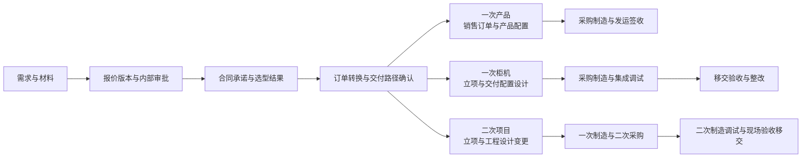

# Forge

**Forge — AI-powered operations from quote to acceptance.**  
从报价到验收，AI 驱动业务全流程。

当前明确目标为完整复刻 RISEMAP，再开展 OEM 适配。执行范围以 [RISEMAP 完整复刻与采集标准](docs/risemap-replication-spec.md) 为准。下文原有柜机优先、缩小首版和三到四周安排属于此前建议，不再限定当前完整复刻范围；正式运行质量要求继续有效。已取得厂商试用入口及专用测试空间授权，目前按业务块滚动推进“取证、实现、同输入对照、定向补证”，试用期优先采集到期后难以补齐的业务行为证据。

Forge 计划面向 OEM 客户，连接报价、订单履行、项目执行与交付确认。产品类围绕销售订单推进，柜机类和二次项目围绕项目交付协作，AI 参与材料整理、信息核对与文档起草。项目从内部业务经验出发，通过真实业务案例逐步形成可复用的产品。

Forge 从首版起按真实客户购买、开通和持续使用设计。已交付范围内的功能须能处理真实业务、保存数据并在异常后继续办理。首版功能范围可分期，运行质量与维护能力随首版一同交付，详见[首个正式版本交付要求](docs/first-release.md)。

当前处于证据采集、执行计划调整与第一批公共模型实现准备阶段。本仓库目前主要包含项目文档、采集证据和业务参考图片；可运行应用尚未形成。新增的持续交接表见 [RISEMAP 滚动复刻交接表](docs/risemap-rolling-handoff.md)，用于记录每个业务块的证据状态、共享对象依赖、未知项、同输入测试案例、实现状态和对照结果。

## 为什么做 Forge

项目源于与一弓讨论的一条产品探索路径。先参考一款成熟的同类型管理系统，再结合惠芸及几个数字化业务线的管理经验，将内部“一次产品”“一次柜机”“二次项目开发”的业务方法和 AI 优化点纳入产品。以三到四周交付首个可供真实客户使用的版本为目标，客户走访与开发同步开展。具体交付范围及交期需按真实订单要求、人员投入和正式运行工作重新估算。

Forge 希望让报价阶段约定的范围、价格与交付要求，能够延续到后续执行和最终验收。围绕这条业务主线，先验证真实使用价值，再逐步扩大功能范围。

三类业务的定义与流程已由内部图片材料明确，详见[业务定义与流程](docs/business-model.md)。根据后续补充的“华炎魔方”线索，已找到官方工程项目管理解决方案并完成公开资料与源码对照，详见[现成方案核查](docs/steedos-solution-assessment.md)。它是优先参考候选，具体交付版本及实操能力仍待确认。

| 内部分类 | 交付方式 | 关键过程 |
| --- | --- | --- |
| 一次产品 | 一次制造，以销售订单为主线 | 产品配置、采购制造、发运签收 |
| 一次柜机 | 一次制造，以项目交付为主线 | 交付配置与工程设计、采购制造、集成调试、移交验收 |
| 二次项目开发 | 二次制造，以工程项目为主线 | 工程设计与变更、一次制造与二次采购、二次制造调试、现场验收移交 |

一次产品包含正标、ETO-、ETO 等类型；一次柜机包含标准、小非标和定制集成交付；二次项目包含系统工程、数字化和智能工厂类项目。是否定制、是否立项，都不能单独决定一次或二次制造分类。

## 首期面向谁

首轮拟从汇川 OEM 客户中选择存在项目交付与验收管理需求的企业。具体细分行业、购买决策人和试点名单，需通过访谈确认。

| 使用者 | 首期希望支持的工作 |
| --- | --- |
| 销售与报价人员 | 整理需求，形成报价，确认版本及交付范围 |
| 项目负责人 | 将成交范围转成任务，跟踪进度和变更 |
| 交付与验收人员 | 汇集交付材料，逐项记录验收结果和整改情况 |
| 业务负责人 | 查看项目所处阶段、待处理事项及责任人 |

## 从报价走到验收

三类业务共享前端，订单转换后分叉。下图依据内部交付流程，并补入 Forge 拟建设的报价与确认环节；详细审批规则待实际单据确认。

销售订单和项目应能追溯成交时采用的报价版本及合同承诺。执行中的范围变化需要记录对费用、交期和交付要求的影响。产品签收与工程验收分别留证，设备已发出不能直接表示工程项目已完成。

原材料还包含开票、回款及服务。Forge 首期保留其关联信息与交接记录，完整财务和售后流程另行建设。

## 三到四周先做什么

建议首期优先一次柜机，完整支持报价、合同与订单交接、立项、设计、调试和移交验收。材料将柜机类作为三智达参照，最终选择仍以真实案例、试点意愿及业务人员投入为准。三类业务的分类与流程均保留，首期实现已确定交付的一条完整路径，并用缩小的产品订单案例检查系统不会强制所有业务立项。小案例通过不代表产品路径已经可售，实际对外交付范围按首批订单确定。

| 范围 | 首版应能办理的工作 |
| --- | --- |
| 客户与需求 | 保存客户、需求及来源材料，能够人工修正 |
| 报价 | 管理报价明细、版本、内部审批和客户确认记录 |
| 订单与项目 | 从合同承诺和订单转换承接交付，柜机路径建立项目并关联报价版本、负责人和任务；产品路径不强制立项 |
| 配置与交付准备 | 记录交付配置、设计版本及采购制造的状态和依据 |
| 变更 | 记录范围变化及其费用、交期影响，保留确认过程 |
| 调试与验收 | 柜机路径关联调试记录、交付物、验收项、整改项和最终确认材料；产品路径单独记录签收 |
| 工作台 | 汇总当前阶段、待办及逾期事项 |

完整 ERP、生产排程、库存财务核算、大量外部系统对接，以及三类业务的全部差异流程，放到客户验证之后另行排期。首版可以先登记合同及外部单据的关联信息。

## AI 先参与两项工作

| 工作 | AI 的输出 | 人员与系统的职责 |
| --- | --- | --- |
| 需求整理 | 从材料中提取需求、约束和待澄清项，附原文依据 | 业务人员核对后形成正式需求，缺失信息保持待确认 |
| 柜机验收准备 | 根据已确认配置、合同范围和调试材料起草验收清单，提示缺失证据 | 验收人员逐项确认，客户的验收结论由实际确认材料支持 |

报价金额由明确的价格、数量和计算规则产生。AI 可以辅助查找资料和解释差异，由人员核对正式结果，模型不自行决定价格或代替客户确认验收。AI 暂时不可用时，人员仍应能够完成主要业务流程。

## 如何推进

完整复刻不再等待全部页面深挖结束后才开发。每个业务块只要核心字段、关系、正常路径和至少一次保存核对结果已有证据，就可以进入实现；未知的状态、权限、配置影响和下游行为继续列为补证项，不能被占位行为或推断规则冒充完成。

滚动推进的固定节奏为：

1. 在 RISEMAP 试用空间逐步操作、截图和记录，保留前置数据、输入、状态变化和结果。
2. 将可复用对象先沉淀为公共定义，包括客户、供应商、物料、单据明细、金额精度、附件、身份、权限和业务关联。
3. 对证据足够的业务块实现可运行、可持久保存、可通过页面办理的功能。
4. 使用同一测试输入在 RISEMAP 与 Forge 中对照，记录通过项、差异和需要返回原系统定向补证的问题。
5. 全量模块、页面、交互、业务规则、角色权限、配置、报表和可用集成均完成对照后，才声明完整复刻完成；OEM 适配另行开始。

三到四周是历史目标窗口，下面按正式交付工作重新安排，尚不是已确认的交期。客户调研、可靠性建设和部署准备从第一周开始。

| 时间 | 主要工作 | 可检查的产出 |
| --- | --- | --- |
| 第 1 周 | 核对首批订单与实际单据，确定可交付范围，完成框架初筛与部署设计 | 业务规则、企业与岗位模型、选型证据及重新估算的计划 |
| 第 2 周 | 建设客户开通、报价、合同与订单交接、柜机立项及配置记录 | 真实账号和持久数据下可办理的业务路径，关键权限与重复操作验证 |
| 第 3 周 | 接通变更、调试、整改验收及已纳入交付的 AI 功能 | 业务人员完成约定流程，异常可续办，备份恢复与升级验证结果 |
| 第 4 周 | 完成发布验证、客户初始化、操作交接及实际使用支持 | 可追溯发布版本、客户环境、交付记录与问题处理安排 |

客户下单后，必须能按约定范围开通、初始化并持续使用。接单和开通首期可以人工办理，但结果须有记录。是否建设自助购买、在线支付及共享多租户服务尚未确定。

若实际只有三周，按客户要求调整功能范围或交期。数据保存、客户隔离、恢复与已承诺业务的正常办理，均计入首版工作。

## 怎样判断可以交付

- 业务人员使用真实账号和代表材料完成已承诺流程，报价、合同、订单、项目、配置变更及验收能追溯；关键步骤无需开发者直接修改数据库。
- 报价驳回、变更、验收未通过、重复提交及同时编辑均有明确处理结果，失败后能够继续办理。
- 至少两个客户环境及不同岗位之间的记录、附件、导出和 AI 访问按权限隔离。
- 业务数据和附件完成备份及实际恢复验证，审批等待期间重启后可继续；后台失败能被发现和处理。
- 编译后的正式发布版本通过业务检查，升级及失败恢复有依据，客户有操作说明和问题反馈入口。
- 已交付 AI 功能连接真实模型，保留依据和人工复核方式，模型不可用时主要业务仍可人工完成。

详细条件见[首版交付要求](docs/first-release.md)。以上均尚未通过实测。历史项目回放、发布前验证和上线后真实在途业务分别记录，当前仓库仍无可运行应用。

## 技术方向

[ObjectStack](https://github.com/objectstack-ai/objectstack) 是优先验证的候选框架。它通过元数据描述业务对象、界面与流程，可能减少基础管理功能的开发工作。是否采用，要结合固定版本的技术初筛和正式交付要求验证，详见[框架评估](docs/objectstack-assessment.md)及[源码拆解](docs/objectstack-deep-dive.md)。

Forge 的业务规则、AI 任务和客户体验仍需独立设计。当前没有确定最终技术栈，也没有可执行的安装或启动步骤。

## 项目文档

- [项目型 OEM 企业运营现状与痛点，9 月 7 日会议提炼](docs/customer-meeting-20260907-findings.md)
- [RISEMAP 功能分析与逐步截图](docs/risemap-capture-analysis.md)
- [RISEMAP 纵向功能走查总览](docs/risemap/README.md)
- [RISEMAP 跨模块业务旅程](docs/risemap/journeys.md)
- [RISEMAP 181 个入口功能清单](docs/risemap-feature-inventory.md)
- [RISEMAP 页面契约](docs/risemap-page-contracts.md)
- [RISEMAP 55 个业务预设字典](docs/risemap-preset-dictionaries.md)
- [RISEMAP 完整复刻与采集标准](docs/risemap-replication-spec.md)
- [RISEMAP 滚动复刻交接表](docs/risemap-rolling-handoff.md)
- [第一版复刻建议，历史方案](docs/v1-replication-plan.md)
- [首个正式版本交付要求](docs/first-release.md)
- [项目背景与推进思路](docs/project-background.md)
- [三类业务定义与流程，含原图索引](docs/business-model.md)
- [ObjectStack 框架评估](docs/objectstack-assessment.md)
- [ObjectStack 源码拆解与采用边界](docs/objectstack-deep-dive.md)
- [华炎魔方及现成业务系统核查](docs/steedos-solution-assessment.md)

文档更新于 2026-09-08。
