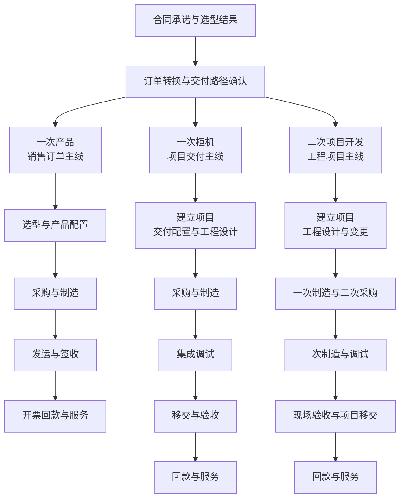

# Forge 三类业务定义与流程

本稿依据发起人于 2026-09-08 提供并确认为内部定义与流程的两张图片整理。原图提供业务分类和流程概览，Forge 的对象结构、首版范围与 AI 用法属于据此提出的设计建议。首版按真实客户使用建设，交付要求见[首个正式版本](first-release.md)。

## 材料与名称对应

| 内部称呼 | 图中对应名称 | 交付模式 | 交付物与管理主线 |
| --- | --- | --- | --- |
| 一次产品 | 一次制造产品类，含 EU 产品类 | 一次制造 | 产品，以销售订单为主线 |
| 一次柜机 | 一次制造柜机类 | 一次制造 | 柜机，以项目交付为主线 |
| 二次项目开发 | 二次制造、工程项目 | 二次制造 | 工程项目，增加二次采购与现场工程 |

名称对应由本轮用户说明及图中分类整理。EU 等内部缩写保留原称，不补充未提供的释义。图片标题中的“共享前端”指共有的前端业务过程，不能直接据此认定三类业务必须使用完全相同的软件页面。

## 共同起点与分叉

材料明确三类交付共享前端，订单转换后分叉。图片 07/16 展示销售合同和选型结果进入客户下单、销售订单转化；图片 08/16 从合同承诺分别展开产品和项目交付路径。报价细节未在这两页展开，Forge 将报价、内部审批和客户确认接到这一入口，是产品设计建议。

下面依据两页内容整理流程概览。订单转换节点统一表达业务交接，柜机与二次项目所需的具体销售单据关联仍需用实际单据确认。



前端选型结果与订单后的产品配置、工程设计分别保留。前者为订单转换提供输入，后者在交付路径中展开；详细交接规则不能仅凭概览图确定。

## 一次产品

图片 08/16 的流程为合同承诺、销售订单、选型与产品配置、采购或制造、发运或签收、开票回款、服务。图片 07/16 进一步区分客户下单、销售订单转化、一次采购或物料齐套、一次制造及物流发货。

产品类包括以下五种。定义和备货策略按图片 07/16 可辨文字摘录及转述，策略保留为材料中的参考口径。

| 子类型 | 材料定义 | 材料中的选型与备货参考 |
| --- | --- | --- |
| 正标 | 现有产品与可选配置 | 按菜谱点菜；ATO，备模块部件 |
| ETO- | 允许定制的配置，含扩展属性或体验属性定制 | 按菜谱点菜；MTO，备一级关键物料 |
| ETO | 超出允许范围的定制，如增强性能属性定制 | 客户定制；ETO，备一级关键物料 |
| 客户专机产品 | 指定单一客户购买的专机产品 | 按成品菜单点菜；MTS，备成品及专用物料 |
| 通用产品／行业专机产品 | 非指定单一客户购买，覆盖跨行业或行业内客户；原图该格末行被下方表格遮挡 | 按成品菜单点菜；MTS，备成品 |

ETO- 中的短横线属于原有技术标识。ATO、MTO、MTS 和 ETO 的内部计算规则、库存触发条件均未展开，暂不据此生成采购或备货逻辑。

产品类存在定制情形，不能仅凭“定制”自动将其转成二次项目。原图的产品路径以发运和签收衔接开票回款，签收不能直接记录为工程验收通过。合同若另有产品验收要求，应另行记录。

## 一次柜机

图片 08/16 的流程为合同承诺、建立项目、交付配置与工程设计、采购或制造、集成调试、移交或验收、回款或服务。该页将柜机类标为三智达的对照参照，并建议通过现场调研确认流程、数据及项目和成本管理差异。

| 项目类型 | 材料定义 | 材料中的工作与费用特点 |
| --- | --- | --- |
| 标准柜机产品交付 | 现有转中试标准柜机的参数值更改，标注 ATO；以标准柜机产品为核心交付 | 产品选型与调试，需要商机项目立项，涉及调试费，按项目制回款 |
| 小非标柜机产品交付 | 在现有转中试标准柜机 BOM 基础上增删、修改参数项；以标准柜机产品为核心交付 | 参数选型与调试，需要商机项目立项，涉及调试费、设计费和认证费，按项目制回款 |
| 定制柜机集成交付 | 无中试母体柜机的非功能／特性定制，如结构、电气定制 | 涉及定制设计、调试、认证和验收，费用含工程项目管理费；该行明确无二次制造采购、无施工工程 |

图中项目制回款举例为“3331等”。付款比例、触发节点和适用条件须以具体合同确认，首版不据此预置强制收款计划。

一次柜机属于一次制造，同时需要项目管理。它具备工程设计、调试和验收工作，判断一次与二次制造不能只看是否立项或是否有设计。

## 二次项目开发

图片 08/16 的流程为合同承诺、建立项目、工程设计与变更、一次制造加二次采购、二次制造与调试、现场验收与项目移交、回款或服务。图片 07/16 同时画出前段一次采购、制造、发运与后段二次采购、物料齐套和工程交付之间的衔接。

| 项目类型 | 材料定义 | 材料中的交付工作 |
| --- | --- | --- |
| 系统工程交付项目 | 以 PLC、EMS 为核心搭建控制系统，涉及公司多产品组合；以中大型设备控制系统、产线及生产控制系统为主 | 设计、施工、安装、调试、功能与性能实现及验收 |
| 数字化交付项目 | 以数字化软件为主，涉及部分与数字源配合的硬件 | 包括设计、施工、安装和调试，并涉及功能与性能实现、数据展示及验收 |
| 智能工厂类项目，自动化加数字化 | 数字化与设备自动化强耦合，设计工厂生产调度与能源管理，涉及产线自动化或设备集成方案 | 设计、安装、调试、管理实现、数据综合展示及验收 |

具体项目是否实施表内每项工作，取决于合同范围。二次项目的验收应覆盖已承诺的系统功能或现场成果；一次制造完成、设备发出或签收，均不能代替整个工程项目完成。

## 对 Forge 产品设计的影响

以下为设计建议。

**保留销售订单与项目两种管理主线。** 客户、需求、报价版本、合同承诺和选型结果可以共用。订单转换时选择交付路径，产品类围绕销售订单推进，柜机类及二次项目建立相应项目。销售订单与项目的数量关系、一个合同是否混合多种交付，待代表单据核对后确定。

**把分类分开记录。** 建议分别记录交付模式、交付物类别及业务子类型。产品类的正标和 ETO 等描述定制或产品类别，柜机类使用三种交付项目类型，二次项目使用系统工程、数字化和智能工厂分类。它们不能全部压入一个“定制程度”字段，也不应推断所有组合都有效。

**用对应的完成依据推进。** 产品类记录发运与签收；柜机类关注集成调试、移交和验收；二次项目另需二次采购及现场工程记录。系统可汇总进度，每条路径的结束条件应分别配置。

**保留回款和服务的业务衔接。** 两页材料覆盖到开票、回款或服务，Forge 首期仍聚焦报价至约定交付完成。可保留付款节点、外部单据和服务移交的关联信息，实际开票、财务核算及完整售后系统另行建设。这是产品范围取舍，原材料中的完整业务流程仍予保留。

## 首期与 AI 的建议

建议优先用一次柜机验证首条完整路径。材料将其作为三智达参照，且它包含项目、设计、调试与验收，能够检验 Forge 的主要价值。最终首期仍取决于代表案例、试点意愿和业务人员投入，图中的参照建议不等同于已经批准实施。

柜机首版记录采购或制造的交付状态、负责人和依据，支持真实更新、纠错与追溯，明确外部系统和人工的衔接方式；完整生产与库存系统另行建设。技术试验另加一条缩小的产品订单路径，检查产品类可以在不强制立项的情况下处理签收。二次项目保留正确分类和完整目标流程，后续实测现场执行能力。只有通过完整业务与运行验收的路径才纳入对外交付范围，产品小案例不代表产品路径已可交付。

首期继续控制为两项 AI 工作。需求整理在共用前端提取合同范围、选型条件和缺失项；验收准备按柜机的已确认配置与调试材料形成待人工复核清单。后续可分别验证产品配置差异核对，以及二次项目设计变更对采购、施工和验收的影响分析。这些优化点来自设计推断，图片未提供已实现的 AI 效果。

## 后续用业务单据补齐

分类与概览流程已经收到，接下来需要的是实际执行规则。

- 报价、合同、销售订单和项目如何对应，混合交付与分批交付怎样处理。
- 前端选型结果如何交接为产品配置或工程设计，配置与 BOM 版本怎样确认。
- 调试、签收、验收和项目移交的完成条件、责任人及证据模板。
- 采购与制造如何反馈状态，二次采购和现场工程由谁负责。
- 变更怎样影响成本、价格和交期，回款节点怎样依据合同确定。

## 原始材料索引

原图按原文件内容复制保存，未裁剪或改写。材料来自“汇川 OTC 实践 × 三智达数字化与 AI 调研”交流讨论，仅包含本次提供的两页。

| 来源 | 图中页码 | 内容 | 文件 |
| --- | --- | --- | --- |
| 用户图片 1 | 08/16 | 三类交付共享前端，订单转换后分叉 | [流程原图](references/delivery-flows-p08.jpg) |
| 用户图片 2 | 07/16 | 狭义 OTC 聚焦订单高效交付，含分类定义表 | [定义原图](references/delivery-definitions-p07.jpg) |

复制后已核对 SHA-256。

```text
delivery-flows-p08.jpg
20e478752f2715195bcb137366ead4e5306bd202b686f545d88c96d3535a61de

delivery-definitions-p07.jpg
e276490d9d568485d8254a3c46c28bd48bd0c4eb797e00f0d9bffc24dd7da7a4
```
