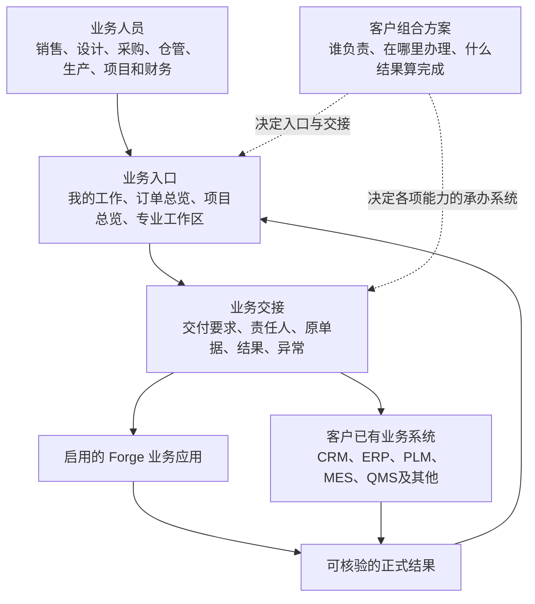

**Forge 客户系统组合架构设计**

版本 v0.2 · 2026-09-12 · 已完成设计审查，待产品决策

本稿回答怎样将 Forge 拆成可选业务应用，并与客户已有 CRM、ERP、PLM、MES 等系统共同完成业务。它定义目标结构、使用方式、组合约束和改造顺序；文中的目标页面和外部协作案例均为设计，尚未实现或完成客户验收。

**1. 产品定位与交付结果**

Forge 面向制造企业提供可组合的业务应用和跨系统业务协作。客户已经有、并决定继续使用的能力，由客户系统承担；缺少的能力，选用达到验收要求的 Forge 应用补齐。客户购买和启用的是需要的工作能力，现有系统可以继续承担原来的工作。

Forge 仍以完整覆盖 RISEMAP 已明确复刻范围的原生能力为建设目标。按客户选用外部系统，改变的是该客户的启用组合，不取消对应原生能力的建设范围。本稿提出的目标应用目录须逐项与复刻范围及客户适配需求对应，不将新增建议直接视为 RISEMAP 已验证能力。

例如，客户已有 ERP 管采购和库存、PLM 管图纸与 BOM，但缺项目计划、工时和现场交付管理。可以只启用 Forge 的项目、工时、交付能力，将 ERP 与 PLM 的正式结果接入订单或项目总览。采购员继续使用 ERP，设计师继续使用 PLM，项目经理在 Forge 跟进整笔交付。

交付给一家客户的成果应包括一份可读的业务组合方案、一组实际启用的应用、能够追溯的系统交接，以及对应业务链的验收记录。不能用一组菜单或连接成功状态代替这些成果。

**2. 整体结构**

这套结构有三种产品角色。业务入口帮助员工找到工作；业务交接跟踪各系统应交付什么；具体业务应用负责执行和形成正式结果。客户组合方案决定每项工作交给谁。

总览围绕已有订单或项目建立业务档案，保存各系统的关联关系。客户 ERP 已有正式项目号时，Forge 可以沿用其关联，不必再办理一次立项。客户已有门户时，也可从原入口进入某项 Forge 能力，入口嵌入与统一登录另行验收。

初期可以保持一个部署、按模块管理代码。子应用的独立启用、业务能力的替换和独立部署是三个决定，部署形式按客户交付需要选择。

**3. 建议拆成八类业务应用**

这些是目标产品边界，并不表示当前 Forge 已经完整具备表内能力。具体实现状态继续以[验证矩阵](forge-verification-matrix.md)为准。

| 可选业务应用 | 用户要完成的工作 | 可选择承办系统的业务能力 | 应交付给其他环节的结果 |
| --- | --- | --- | --- |
| 客户与销售 | 跟进客户，报价，签约，承接订单 | 客户档案、商机、报价、合同、订单接受 | 有效需求、合同承诺、已接受订单及变更 |
| 项目与计划 | 立项，排计划，安排人员，跟踪投入 | 项目登记、计划与基线、任务、工时、项目费用 | 当前计划、实际进展、投入与阻塞 |
| 设计与技术资料 | 设计、评审、发布并处理变更 | 图纸、设计 BOM、制造 BOM、版本发布、变更评审 | 指定用途的有效版本与变更影响 |
| 采购与供应 | 处理缺料，采购，到货和供应商协作 | 采购申请、采购订单、到货、检验、退换货 | 采购承诺、到货与检验结果、后续入库要求 |
| 仓储与物流 | 查库存，预留，收发存，安排物流 | 可用量查询、预留与释放、出入库、调拨盘点、运输 | 有效预留、实际库存变动、物流与签收记录 |
| 制造与质量 | 组织制造、装配、检验和返工 | 工单、领退补料需求、报工、过程检验、完工与返工 | 生产进度、合格完工结果、耗用与质量记录 |
| 交付与服务 | 现场安装，调试，验收，移交和售后 | 发运协调、现场任务、问题整改、验收、服务工单 | 合同要求的签收或验收依据、移交与服务结果 |
| 财务与经营 | 开票，收付核销，归集成本，经营复盘 | 应收应付、发票、收付款、核销、成本与收入确认、经营分析 | 正式收付与结算状态、来源明确的经营口径 |

应用是客户选择功能的层次，能力是确定工作交给谁的层次。例如客户可以用 Forge 管采购申请、ERP 管采购订单、QMS 管到货检验。能力按完整业务结果划分，避免把“新增”“保存”“审核”三个按钮分别交给不同系统。

跨应用动作遵守业务归属。制造应用提出领料要求，仓储系统确认实际扣账；交付应用提出发运要求，仓储系统确认出库；采购入库也不直接等于应付形成。总账与税务等能力只按明确交付范围接入或建设，本稿不承诺现有 Forge 可以替代完整 ERP。

所有应用共用身份与组织、业务编号关联、单位与币种口径、附件引用、消息待办和操作记录。共用支撑可以引用客户主数据，不能把“共用”解释为要求客户把所有档案迁入 Forge。

**4. 三种交付路径分别成立**

保留[三类业务定义](business-model.md)中的共享商务入口与交付分叉。合同约定决定实际条件，下表为结构依据。

| 交付路径 | 办理主线 | 典型过程 | 完成依据 |
| --- | --- | --- | --- |
| 一次产品 | 销售订单 | 接单、配置、采购或制造、发运、签收、开票回款 | 按合同取得签收等交付依据，产品验收有约定时单列 |
| 一次柜机 | 项目交付，关联商务单据 | 立项、配置与设计、采购制造、集成调试、移交验收、回款 | 柜机对应的调试、验收与移交结果 |
| 二次项目开发 | 工程项目，关联商务单据 | 工程设计、一次制造与二次采购、二次制造、现场调试、验收移交 | 合同范围内的现场与系统成果验收 |

一次产品不强制立项。一次柜机涉及设计和调试，仍属于一次制造。发货或签收不能自动替代工程验收。总览允许分批交付、分项完成、采购制造并行及变更返工；开票与回款按合同节点穿插办理。

现有[九阶段信息架构](forge-otc-information-architecture.md)适合呈现整体业务范围，其中“项目审核生效”“有效订单关联项目”不应成为所有订单的必经条件。后续实现按交付路径裁剪总览和进入条件，九阶段不作为所有业务都必须依次完成的固定审批链。多类型合同、一单多项目或多单一项目的具体关系需结合客户实际单据确认，不预设所有单据一对一。

**5. 一份客户组合方案怎样表达**

下面三列是假设配置，用于解释产品结构，不代表已调研或已接通的客户。

| 工作能力 | 客户甲，缺少业务系统 | 客户乙，已有 ERP | 客户丙，已有多套系统 |
| --- | --- | --- | --- |
| 客户与商机 | Forge | Forge | 客户 CRM |
| 正式销售订单 | Forge | 客户 ERP | 客户 ERP |
| 项目计划与工时 | Forge | Forge | Forge |
| 图纸与设计 BOM 发布 | Forge | Forge | 客户 PLM |
| 采购订单 | Forge | 客户 ERP | 客户 ERP |
| 库存预留与出入库 | Forge | 客户 ERP | 客户 ERP 或 WMS，按仓库确定 |
| 制造与过程质量 | Forge | Forge | 客户 MES／QMS，按结果分工 |
| 现场调试与验收 | Forge | Forge | Forge |
| 开票收付与结算 | Forge 已交付能力 | 客户 ERP | 客户 ERP |

每项配置至少写明适用客户、法人或工厂、业务能力、承办系统、使用方式、正式结果、业务负责人、生效日期与方案版本。例如“甲公司一号工厂的原料仓，库存预留和扣账均由 ERP 办理；Forge 展示结果并发起预留”。

同一客户可以使用两套 ERP，但每笔工作必须明确落在哪个组织和业务范围。配置存在重叠、缺少必需能力或缺少对应办理路径时，不能启用相应自动流程。依赖可以由 Forge、客户系统或明确的人工环节满足，安装了某个应用不能自动视为依赖已齐全。

能力切换按新版本和生效范围执行。新业务使用新方案，在途业务保留原承办系统和原版本；确需迁移的业务单独核对正式单据、未完数量、预留和余额，完成交接后再切换。已经发生的扣账或收付款需要原系统的冲销或调整凭据，修改配置不能撤销业务结果。

旧业务应继续保有查询原系统和接收回传所需的关联与配置；当前人员能否办理仍按当前有效权限判断，不能因业务使用旧方案而沿用已经撤销的授权。

**6. “接入”分为三种使用方式**

| 使用方式 | 员工看到什么、怎样操作 | 前提与完成条件 |
| --- | --- | --- |
| 在 Forge 办理 | 用 Forge 页面完成工作，取得 Forge 正式单据 | 对应能力达到约定业务验收，遵守岗位权限和审批 |
| 从 Forge 发起，由客户系统办理 | 点击业务动作，看到办理中、原单号和最终结果 | 客户接口支持该动作与结果查询，正式审批和记账仍服从承办系统规则 |
| 到客户系统办理，Forge 跟踪 | 从待办打开原系统，回到总览查看结果；必要时由负责人提交凭据 | 可通过只读查询、结果同步或有凭据的人工确认取得结果；没有依据时继续等待 |

有系统但没有可写接口时，可采用第三种方式。人工确认保留确认人、时间、原单号和凭据，并在页面标注来源；它只满足约定的协作检查点，不能伪装成 ERP 自动审核、自动记账或实时库存。

例如 ERP 已经管理某仓库但只开放库存读取，Forge 可以展示库存并引导人员到 ERP 预留、出库，不能通过在 Forge 新建预留和扣账来“补齐”这个仓库的写能力。Forge 接管另一个独立范围或整体迁移该范围，需要明确交接并验收。

“没有能力就用 Forge”是实施配置原则。已经选用 ERP 后，ERP 暂时不可用时不能自动改由 Forge 扣库存或收付款。查询可以展示带时间的最近记录，正式办理则进入等待或异常处理。

**7. 员工日常怎样用**

普通员工进入“我的工作”，看到要办什么、对应订单或项目、要求日期、当前阻塞和下一步按钮。专业岗位保留适合日常工作的列表、明细和批量办理入口，应用拆分不要求员工逐个子应用找事情。

销售从订单总览看承诺、备货、发运与回款；项目经理从项目总览看计划、设计、采购、制造、现场、费用与验收。每个环节集中显示业务结果、责任人、承办系统、原单据、来源更新时间以及下一步。

例如“电控柜项目 A 的物料齐套”可以显示“需要 100 件，ERP 已预留 80 件，20 件待采购”。旁边显示预留单、缺料明细、采购负责人和“查看采购进度”。这些数字是设计示例。结果未回传时显示“已提交 ERP，预留结果待确认”，不把预计可用量写成已预留量。

设置人员使用“客户业务组合”配置页面，回答谁负责、在哪里办理、依赖是否具备。业务人员看到“在 ERP 审核采购单”“等待 PLM 发布版本”等业务提示，无需理解连接器和底层数据结构。

成本、利润、附件和业务动作按用户在客户组织中的权限展示。能够登录 Forge 不等于拥有原系统的审批权；原系统接口使用服务账号时，也要校验当前办理人的业务权限并保留实际发起人。

**8. 正式记录和数据归属怎样分**

| 数据或结果 | 归属原则 | Forge 保留什么 |
| --- | --- | --- |
| 客户、物料、供应商、员工等主数据 | 按档案类型及组织范围确定来源，必要时区分客户商业档案与财务档案 | 跨系统对应关系、所需摘要、来源和更新时间 |
| 图纸与 BOM | 按设计、制造等用途分别确定版本发布方，保留转换和引用关系 | 被业务采用的明确版本、发布依据和变更影响 |
| 库存、正式订单、发票、收付款 | 每份正式记录及所属业务范围都有明确承办系统 | 原单据关联、状态、所需结果快照及核对记录 |
| 项目任务、工时、现场问题等缺失能力 | 由客户组合方案选中的 Forge 或客户应用负责 | Forge 承办时保留完整业务记录，外部承办时保留关联结果 |
| 跨系统进展与交接 | Forge 跟踪待办、责任和取得的结果 | 交接历史、当前阻塞和异常处理依据 |

单号相同不代表同一单据，名称相同不代表同一物料。对应关系需要包含客户、来源系统、组织范围、原记录标识及必要版本；物料还要明确规格、单位换算、仓库和批次要求。无法确认的对应关系应进入待核对，由指定资料负责人处理，不能自动猜测合并。

同一仓库范围的库存预留、释放、出入库必须由同一套正式库存账控制。跨 ERP 与 WMS 分工时，先约定库存执行方、账务记录方及差异核对规则；库存查询展示可单独接入，但读到的历史余额不能代替实时预留结果。

经营分析注明数据来源、时间、币种和确认口径。ERP 的应付金额与 Forge 的采购金额不能相加为两笔成本，收款也不能直接当作收入。缺失或未核对数据应明确展示，不能用零代替。

**9. 一次跨系统交接怎样算完成**

每次交接都说明谁提出、谁办理、对象和版本、数量金额及单位、关联订单或项目、要求结果、下一责任人。相同业务请求保留同一个办理编号，发起前先持久保存交接记录，重启后也能继续查找。

办理编号固定对应本次申请的对象版本、数量和审批依据。已发送的申请需要修改时，先确认旧请求的实际结果，再形成新的申请版本并按规则重新审批；不能复用原编号改变数量，也不能拿旧版本的回执完成新申请。

| 当前情况 | 页面状态 | 后续动作 |
| --- | --- | --- |
| 尚未向承办系统发出 | 待办理 | 按权限提交或打开原系统 |
| 承办系统已接收，尚无正式结果 | 办理中或待原系统审批 | 查原单据与进展，不提前推进结果依赖环节 |
| 请求超时，无法知道是否执行 | 结果待确认 | 使用原办理编号查询，不生成第二笔业务请求 |
| 只完成部分数量或部分明细 | 部分完成 | 展示完成与未完明细，仅对剩余部分继续处理 |
| 原系统明确拒绝 | 办理失败 | 显示业务原因和处理人，修正条件后按约定重新办理 |
| 得到可核对的正式结果 | 已完成 | 保存结果与来源，推进已满足条件的下游工作 |
| 原结果撤回、冲销或版本作废 | 结果已变更，需处理 | 保留原历史，标记受影响下游，按业务规则处理 |

重复返回相同结果只确认一次。较旧状态不能覆盖新状态，撤回等变化需保留明确的更正记录。只有承办系统保证相同办理编号只执行一次，或者取得原请求确定未执行且不会继续执行的可靠依据，才允许补发。普通超时、暂时查不到单或人工尚未确认，都不足以支持重新办理。缺少这些条件的接口只能继续核对或转人工处理。

每个接入约定结果获取方式和最长允许未核对时间。自动回传之外，定期核对未完成交接和发生变化的正式结果，发现回传缺失或双方不同步时交给明确负责人。多个系统的审批各有目的，例如 Forge 做发起资格检查、ERP 做正式采购审批；重复的同目的审批应在实施时去除。

跨系统一部分已成功时，保留真实状态并继续完成剩余工作，或由对应系统执行有依据的取消、释放和冲销。不能把整个流程画回“未发生”，掩盖已经扣账的业务。

**10. 用一笔业务说明组合结果**

以下为柜机交付的设计示例，客户有 CRM、PLM、ERP 和 MES，Forge 补项目计划、工时和现场交付。

1. CRM 确认需求与商机。正式订单在 ERP 接受后，Forge 关联原订单，并按柜机路径组织项目工作；已有正式项目号则沿用其关联。
2. 项目经理在 Forge 安排设计、采购、装配和现场计划。PLM 发布本次交付采用的图纸和 BOM 版本，Forge 记录版本及发布结果。
3. Forge 根据适用 BOM 提出备料要求，ERP 查询并正式预留库存。库存不足的部分按客户采购分工形成采购工作，只有有效预留和到货入库等结果满足条件后才能确认对应齐套状态。
4. MES 承担制造，实际领料扣账服从 ERP／WMS 的库存分工。Forge 汇总进度与阻塞；MES 的完工报告按约定检验与入库条件衔接下一步。
5. ERP／WMS 确认出库后，Forge 跟进现场安装、调试、整改及客户验收。发货完成与验收完成分别呈现。
6. ERP 按合同办理开票、收款和核销，Forge 将正式财务结果与现场验收、工时和费用关联，供项目复盘使用。

同一交付路径可以采用不同的能力组合。没有 PLM 时，已交付的 Forge 设计能力提供有效版本；没有 ERP 时，由达到约定验收要求的 Forge 库存与采购能力承办。流程检查所需业务结果，客户系统的字段差异在对应接入中处理。

**11. ObjectStack 承担什么，Forge 还要建设什么**

| 范围 | 已核对的基础机制 | 本设计要求 Forge 建设的产品能力 |
| --- | --- | --- |
| 应用和业务页面 | 对象、动作、页面和应用装配 | 八类业务应用边界、独立启用、订单与项目双入口 |
| 外部业务调用 | REST、OpenAPI、MCP 连接器 | 各厂商及客户版本适配、业务含义转换、权限和结果核对 |
| 外部数据读取 | 外部数据源和对象映射 | 主数据对应、正式来源、时效、组织与单位口径 |
| 流程与通知 | Flow、条件与等待节点、Webhook 投递机制 | 客户组合方案、交接持久记录、重复防护、漏回传核对和在途切换 |

ObjectStack 官方资料说明[连接器](https://objectstack.ai/docs/automation/connectors)负责对外调用，[外部数据源](https://objectstack.ai/docs/data-modeling/external-datasources)提供外部数据映射，[Flow](https://objectstack.ai/docs/automation/flows)提供流程节点。连接器通了仍需完成业务规则与客户权限适配；读外部数据库不等于已经能够通过原系统的正式审批与记账。

[Webhook 文档](https://objectstack.ai/docs/automation/webhooks)说明投递入队后的持久重试边界，业务写入至入队之间并非自动具备完整原子保证。因此本设计要求单独验证交接记录的持久保存、发送、回查和漏回传核对，不能把安装框架当作业务不会丢失或重复的证明。

当前基线为本地主线 `2d0f303`，`@objectstack/spec` 与运行时固定为 `17.3.0`。[入口配置](../apps/forge-objectstack/objectstack.config.ts)仍集中装配一个 Forge 应用；[库存动作](../apps/forge-objectstack/src/actions/inventory.action.ts)直接修改 Forge 库存余额与流水，采购等链路也存在内部直接关联。客户组合配置和业务能力替换尚未接入。当前多对象业务写入的恢复和岗位权限边界也需要随所选切片验证。

**12. 改造与交付顺序**

| 阶段 | 交付物 | 进入下一步的依据 |
| --- | --- | --- |
| 先确定产品边界 | 能力目录、三类交付路径、组合规则、页面责任、正式记录归属 | 用典型客户配置走读，确认必需能力与交接条件完整 |
| 把现有 Forge 纳入统一能力边界 | 先整理所选业务链，现有功能作为 Forge 提供的能力，默认保持现有办理方式 | 原链路仍通过相称的接口、同库重启及页面验收 |
| 完成首条可替换业务链 | BOM 需求、库存查询、预留、释放、结果核对；Forge 与一个明确外部系统两种配置 | 两套配置均完成真实业务与异常验收，接口模拟结果单独标注 |
| 验证多系统协作 | 至少覆盖设计版本、库存办理和交付跟踪三方交接 | 真实单据串联，原系统、Forge 页面及重启后结果一致 |
| 按业务依赖扩展 | 采购、生产、交付、财务等能力逐条纳入 | 每个新增系统与业务链具有明确支持范围及验收记录 |

首条切片建议选择库存查询、预留与释放，所需预留能力若当前尚未具备，应先纳入切片建设。外部系统选择尚未确定，需取得其接口、可用环境和对应业务联系人后明确适配范围；这不阻碍先完成能力边界设计。

保持现有稳定记录标识和已经验证的业务行为，按链路替换跨模块直接依赖，逐条纳入统一交接，不要求一次搬迁全部数据库或拆成多个服务。Forge 原生能力的 RISEMAP 对照仍继续；外部系统正式办理以客户实际规则为准，新增跨系统行为单独留证。当前授权范围为架构设计，本稿没有启动运行时重构。

**13. 验收如何证明“能够组合”**

| 要证明的结果 | 验收方式 |
| --- | --- |
| 产品与项目都能成立 | 一笔一次产品订单不经强制立项也能交付；一笔柜机或工程项目保留必要调试与验收 |
| 同一业务能切换提供方 | 相同业务约定分别使用 Forge 和外部系统，分别核对真实结果；两种配置具有可观察的同等完成条件 |
| 组合保留原系统责任 | 外部预留、审核、出入库在原系统形成正式记录；Forge 没有另建冲突库存账或重复正式审批 |
| 多系统能交接 | PLM 或相当设计来源的有效版本、ERP 库存结果与 Forge 下游任务能按原单号和版本追溯 |
| 异常时结果不被误报 | 覆盖重复请求、超时后实际成功、重复与乱序回传、部分成功、撤回和漏回传，界面状态与原记录一致 |
| 外部已成功但响应丢失时不重复办理 | 外部执行成功后中断响应，恢复后确认只存在一笔正式办理及对应库存变化，原任务按同一编号续办 |
| 申请和结果版本不会错配 | 预留过期或 BOM 改版后重新核对齐套状态；旧回执不能完成新版本申请，释放与重新申请有完整依据 |
| 停服后能够继续 | 发起后未取得结果时停服，从同一持久数据库重启，找回交接与原编号，完成核对且不重复办理 |
| 配置切换不影响在途业务 | 新业务走新方案，旧业务仍能取得原系统回执并按原方案完成，当前有效权限继续生效，迁移业务有对应交接依据 |
| 权限和组织口径一致 | 用真实岗位范围检查页面、查询、附件、导出和动作；不同客户、法人、仓库与物料映射不串用 |
| 员工能完成工作 | 真实页面操作能看懂状态、找到责任人及下一步，外部办理后能在总览追溯结果，不要求重复录入同一正式单据 |

本轮仅完成设计审查和文档检查。模拟服务只能证明机制；真实业务接入需同时核对原系统、Forge 接口、同库停服重启与关键页面，最终由业务负责人确认结果。

产品边界与交接规则分别由独立审查者检查，意见及处理见[设计审查记录](forge-customer-composable-architecture-review.md)。设计审查不等于运行时实现验收。

**14. 依据与仍需客户落实的条件**

当前用户明确提出“没有就用我们的，有就用他们的”，本稿据此将正式记录的归属设为按客户和业务范围选择。此前文档中将所有正式业务结果统一归 Forge 的候选描述，不适用于这一目标。

[业务定义](business-model.md)支持三条交付路径；[九阶段信息架构](forge-otc-information-architecture.md)提供阶段范围；[客户会议分析](customer-meeting-20260907-findings.md)说明已存在 ERP、Excel 和内部工具协作的单一企业样本，不能将其推广为所有制造客户。[验证矩阵](forge-verification-matrix.md)约束当前实现声明。官方机制资料见第 11 部分，核对日期为 2026-09-12。

落实首家客户方案时需明确已有系统及版本、必需保留的能力、实际可用接口、正式档案与账务来源、组织权限、三类交付路径和首笔验收业务。架构可以先确定这些配置项与规则，实际值待客户材料落实，不预填为事实。
