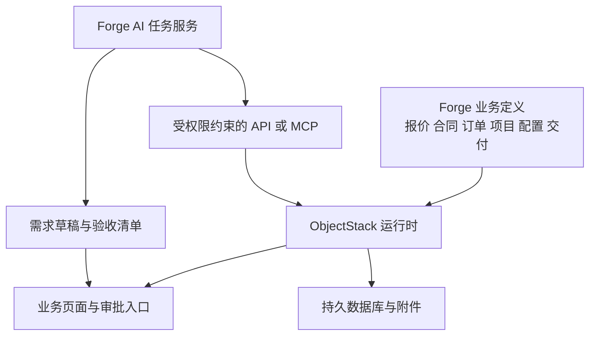

# ObjectStack 对 Forge 的适配评估

**当前交付前提**　Forge 首版供真实客户购买和持续使用。框架试验与厂商演示只提供选型证据，正式交付须满足[首版交付要求](first-release.md)。本文件中的源码事实沿用核查快照，未因此新增运行通过结论。

核查日期为 2026-09-08。本次核对了官方文档、官方仓库信息和 npm 发布元数据，未安装运行框架，未验证真实业务流程。以下将官方描述与 Forge 的采用建议分别表述。

业务适配部分已按发起人补充的[三类交付定义与流程](business-model.md)修订。本文保留初步资料核查快照；后续已补充[源码拆解](objectstack-deep-dive.md)及[华炎魔方方案核查](steedos-solution-assessment.md)。新增的业务建模与试验要求尚未实测。

## 当前判断

建议将 ObjectStack 作为 Forge 的优先技术试验候选，先用两个工作日验证一条缩小的一次柜机报价到验收流程，并检查产品订单可以独立于项目推进，作为选型初筛，再核验正式运行与客户交付能力。

Forge 需要大量相互关联的业务记录、表单和状态操作，ObjectStack 的元数据方式与这些工作有较高契合度。它有望减少基础管理页面的开发量，让团队更快调整对象和流程。节省多少时间尚无本项目实测结果。

新材料明确了两种管理主线及三条交付路径。选型试验应检查它能否复用前端业务记录，又分别表达销售订单、柜机项目和二次工程项目的状态及完成依据。完整生产排程、工程成本核算和现场执行能力不由本轮资料评估作出承诺。

采用成本主要集中在框架学习、版本变化、复杂业务动作和 AI 运行时接入。官方能力目录尚不足以证明它能在 Forge 的目标周期内稳定工作，技术试验应直接检验这些部分。

## 先分清几个产品

| 名称 | 官方定位 | 对 Forge 的意义 |
| --- | --- | --- |
| ObjectStack | 开源业务应用框架，包含协议、内核、工具和运行时 | 本次评估的候选框架 |
| ObjectUI | 按元数据渲染界面的 UI 层 | 可用于快速构建管理界面，关键任务的操作体验仍需验证 |
| ObjectOS | 基于 ObjectStack 的商业产品，提供浏览器中的构建与运行体验 | 若选择购买，应另外评估产品能力和商业条件 |
| HotCRM | 官方 CRM 参考应用，包含客户、商机、报价及合同等对象 | 可学习对象关系与应用组织方式，交付验收仍需设计 |

ObjectOS 官方仓库说明，产品源码未在该公开仓库发布。HotCRM 是技术参考应用。后续根据“华炎魔方”线索找到工程项目管理方案，已将其列为一弓所述系统的优先候选，具体版本及销售情况尚未确认。[ObjectOS 官方说明](https://github.com/objectstack-ai/objectos)、[HotCRM 官方说明](https://github.com/objectstack-ai/hotcrm)

## 它怎样构建业务系统

ObjectStack 使用 TypeScript 和 Zod 定义并校验元数据，描述业务对象、界面、权限和自动化。ObjectQL 处理数据访问，内核组织服务与插件，ObjectUI 呈现界面，运行时提供 REST 和 MCP 等访问入口。对 Forge 而言，这意味着一部分字段和界面变更可以围绕同一套业务定义完成。[入门说明](https://objectstack.ai/docs/getting-started)、[官方架构说明](https://github.com/objectstack-ai/objectstack/blob/main/ARCHITECTURE.md)

下面是建议的 Forge 应用组织方式，尚未实现。

## 对照 Forge 的关键需求

下表的框架能力来自官方资料，最后一列是 Forge 需要自行完成或实测的工作。

| Forge 需求 | 官方提供的机制 | 适配判断与剩余工作 |
| --- | --- | --- |
| 客户、报价、合同、订单和项目记录 | 对象、字段、关联及数据访问接口 | 分开表达销售订单与项目，保留订单转换和原始承诺的关联 |
| 订单与项目的不同生命周期 | 状态机约束与 Flow 自动化 | 验证产品签收、柜机验收、二次项目现场移交的不同完成条件 |
| 报价审批 | Flow 审批节点、审批记录及记录锁定 | 需要验证驳回重提、重启续办和重复点击 |
| 报价工作台与项目看板 | 表格、看板、甘特图及页面组合 | 先验证核心任务是否顺畅，复杂明细编辑和客户文档导出单独验证 |
| 成本与客户数据访问 | 岗位、权限集、记录范围和字段权限 | 需要显式保护成本字段，验证页面、接口和 AI 的访问一致性 |
| AI 辅助业务 | MCP 工具及知识检索相关协议与插件 | 模型调用、业务提示、材料处理及结果复核仍需接入 |
| 交付验收 | 可用对象、附件、动作和审批机制表达 | 验收标准、整改流程与客户确认记录需由 Forge 建模 |
| 配置、BOM 与设计变更 | 可通过对象关联和业务动作尝试表达 | 版本关系与变更规则由 Forge 设计，不代表已有完整工程设计或 BOM 管理产品 |

资料依据分别为[数据与业务定义](https://objectstack.ai/docs/getting-started)、[生命周期与自动化](https://objectstack.ai/docs/automation/workflows)、[审批](https://objectstack.ai/docs/automation/approvals)、[界面](https://objectstack.ai/docs/ui)、[权限](https://objectstack.ai/docs/permissions)和 [AI](https://objectstack.ai/docs/ai)。

## 会影响选型和排期的边界

### AI 开发能力与业务 AI 需要分别投入

官方文档明确区分用 AI 编写应用，以及让 AI 操作运行中的应用。开源框架采用自带模型和密钥的接入方式；内置产品聊天及相关聊天端点属于 ObjectOS。Forge 若基于开源版建设，应自行安排模型接入和业务任务交互，不能将 ObjectOS 的聊天体验计入开源版默认交付范围。[AI 官方边界说明](https://objectstack.ai/docs/ai)

建议首期提供“整理需求”和“准备柜机验收清单”两个明确入口，输出可编辑草稿及材料依据。前者处理共用前端的范围和选型条件，后者依据柜机配置与调试材料起草清单。产品配置核对和二次项目现场变更分析后续分别验证，开发量仍需技术试验估算。

### 当前版本需要精确固定

本次直接查询 npm，`@objectstack/cli` 与 `@objectstack/spec` 的 `latest` 均为 `17.3.0`，声明 Node.js 至少为 `22.0.0`。官网发布页也列出 17.3.0，并说明当前发布窗口的小版本可能包含破坏性变更。[CLI 发布元数据](https://registry.npmjs.org/@objectstack%2fcli/latest)、[Spec 发布元数据](https://registry.npmjs.org/@objectstack%2fspec/latest)、[版本政策](https://objectstack.ai/docs/releases)

建议技术试验从 17.3.0 的一致版本组合开始，固定完整依赖和运行时版本，记录实际可用的组合。后续按已验证版本推进，升级另做回归。这里的版本号是核查快照，尚非已通过 Forge 验证的推荐版本。

### 审批流程需要端到端核验

官方说明审批插件负责持久化审批请求和决策，并在决策后继续 Flow。文档同时指出，审批结果回写后触发的后续流程涉及运行身份选择；普通对象列表也不能直接替代审批收件箱。这会影响报价审批的后续交接。Forge 还须分别记录客户确认、合同承诺和订单转换，不能将内部审批通过直接等同于所有业务都已立项。[审批流程说明](https://objectstack.ai/docs/automation/approvals)

Forge 还需验证审批锁是否覆盖报价明细，报价版本能否保持不变，以及立项动作失败重试时是否只产生一个项目。以上是本项目的待测要求，当前没有认定框架已满足或存在缺陷。

### 权限需要用业务人员身份测试

当前官方权限模型使用岗位、权限集和业务组织范围，字段未声明限制时默认可见。因此，成本、毛利等内部字段需要明确规则，不能仅在页面上隐藏。[权限模型说明](https://objectstack.ai/docs/permissions)

技术初筛可先在一个企业环境内测试销售、审批人及项目负责人之间的数据和操作边界。正式交付前须用至少两个客户环境验证隔离。采用独立部署或共享服务，应结合首批交付要求确定；客户登录、开通与岗位管理纳入首版建设。

### 自部署已有官方路径，产品运营仍需建设

官方提供运行时镜像和编译后的应用制品部署路径，并将平台版本与应用版本分别管理。[部署说明](https://objectstack.ai/docs/deployment)

Forge 可优先验证独立部署的首版。数据库迁移、附件保留、重启恢复和导出仍须用项目数据实测。客户开通、升级维护及交付支持同时纳入首版产品设计。

## 建议的首批业务对象

以下按已收到的内部分类与概览流程提出建模草案。具体字段、单据数量关系及状态规则待代表业务材料确认。

| 对象 | 应保留的关键关系 |
| --- | --- |
| 客户与需求 | 需求关联客户，并保留来源材料 |
| 报价与报价版本 | 版本关联明细、内部审批及客户确认材料 |
| 合同承诺与订单转换记录 | 关联报价、选型结果及客户订单，保留交付路径选择依据 |
| 销售订单 | 产品类的管理主线，关联配置、采购制造和发运签收；不强制依赖项目 |
| 项目 | 柜机或二次工程的管理主线，追溯合同与订单转换，并关联具体报价版本和交付范围 |
| 交付配置与设计版本 | 保留配置、BOM 或设计文件版本，关联适用订单或项目；首版先管理版本与引用 |
| 任务与里程碑 | 关联项目、负责人和完成依据 |
| 变更 | 关联订单或项目及具体配置或设计版本，保留调整前后内容及确认记录 |
| 采购制造与现场工作记录 | 按交付类型记录状态和依据，区分一次采购制造、二次采购制造及现场工作；首期只实现柜机所需部分 |
| 交付物与签收记录 | 关联订单或项目，签收单独记录，涉及工程验收的交付物再关联验收项 |
| 验收项与验收记录 | 关联交付物、整改项及客户确认材料 |
| 回款节点与服务移交引用 | 保留合同约定和外部记录关联，首版不承担实际开票和财务核算 |

分类应分别表达一次或二次制造、产品或柜机或工程项目，以及对应业务子类型。建议复用客户、报价和合同记录，销售订单与项目分别建模，三条路径采用各自的状态和完成依据。产品类允许 ETO，柜机类需要项目管理，这些关系应成为分类校验案例。混合交付与分批交付规则尚未提供，暂不固定订单与项目的一对一关系。

## 两个工作日的技术试验

这是下一阶段建议，当前尚未执行。已收到分类流程图片，代表项目单据仍待提供。试验优先使用一次柜机的脱敏材料，并加一个缩小的产品订单案例；演示数据只能验证技术连接，不能代替业务验证。

| 时间 | 试验内容 | 通过条件 |
| --- | --- | --- |
| 第一天上午 | 固定版本，连接持久数据库，建立报价、合同、订单与项目的最小关系 | 能保存、查询数据，重启后数据仍在，产品订单不强制立项 |
| 第一天下午 | 柜机报价驳回重提，记录客户确认和合同承诺，经订单转换建立项目 | 记录可追溯，重复操作只创建一个柜机项目，产品路径保持独立 |
| 第二天上午 | 登记柜机配置版本、一次变更、调试与验收整改，测试不同身份；产品案例登记签收 | 变更不覆盖旧版本，产品签收不触发工程验收，未满足柜机验收要求不能完成，内部字段不越权 |
| 第二天下午 | 接入一个 AI 草稿任务，验证失败处理和迁移 | 输出有材料依据，AI 失败后可人工继续，新增字段不损坏原有记录 |

试验同时安排一次审批等待期间的应用重启，确认审批人可以继续办理；对报价、订单转换和验收动作测试重复请求。采购制造在该试验中只登记交付状态，不运行生产系统。二次项目只核对分类和目标流程，不计为现场工程已验证。记录搭建时间、所需定制代码、框架阻塞问题及复现步骤。

若关键路径通过，且无需修改框架内核即可表达首期规则，可进入 ObjectStack 候选实现阶段。通过两天初筛不构成上线依据，还需完成客户隔离、备份恢复、发布升级及真实业务办理等交付验证。若仅界面体验不合适，先评估局部自定义页面。若两天内仍无法完成持久化审批、版本追溯或受限业务动作，暂停将它作为首版主框架，改用团队熟悉的应用栈；保持相同业务范围，避免继续扩大试验。

## 核查记录与未完成工作

本次官方仓库 API 返回的 `main` 提交为 `56ee7aef1d49d7583e0cb268dc6cbd1c34ee8fd0`，提交日期为 2026-09-08 UTC。仓库标注 Apache-2.0，本次获取时未归档。[固定提交](https://github.com/objectstack-ai/objectstack/tree/56ee7aef1d49d7583e0cb268dc6cbd1c34ee8fd0)、[仓库信息](https://api.github.com/repos/objectstack-ai/objectstack)

另抽查了该提交的包清单和审批插件入口。CLI 清单列有 Console、审批、权限、MCP 和 SQL 驱动依赖；审批入口导出服务和 Flow 节点注册接口。这能确认相关包与入口存在，未验证内部实现的正确性。[CLI 包清单](https://github.com/objectstack-ai/objectstack/blob/56ee7aef1d49d7583e0cb268dc6cbd1c34ee8fd0/packages/cli/package.json)、[审批插件入口](https://github.com/objectstack-ai/objectstack/blob/56ee7aef1d49d7583e0cb268dc6cbd1c34ee8fd0/packages/plugins/plugin-approvals/src/index.ts)

仓库提交、npm 发布版和官网文档分别更新，本文未证明三者逐项一致。实施时以固定发布版的实测结果为准。

后续已完成关键源码路径抽查，见[源码拆解](objectstack-deep-dive.md)，未完成完整代码审计、安装启动、浏览器操作、并发恢复、数据迁移以及客户流程验证。三类业务定义与概览流程已收到，华炎魔方工程项目方案已列为参考候选，具体可运行交付包及代表业务单据仍待取得。当前结论支持启动有限技术试验，正式选型需补上上述关键证据。
