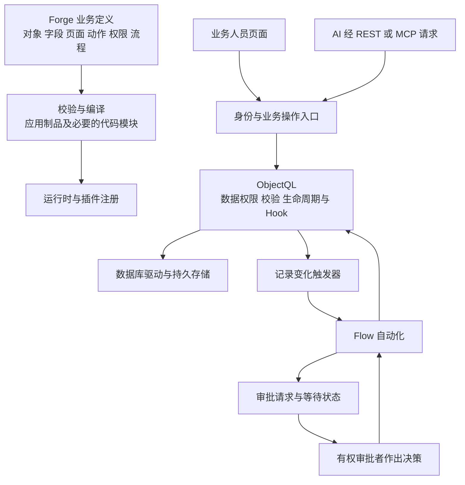

# ObjectStack 源码拆解与 Forge 采用边界

**当前交付前提**　Forge 首版供真实客户购买和持续使用。框架试验与厂商演示只提供选型证据，正式交付须满足[首版交付要求](first-release.md)。本文件中的源码事实沿用核查快照，未因此新增运行通过结论。

核查于 2026-09-08。本文补充[初步评估](objectstack-assessment.md)，以固定提交的目录、应用定义及关键实现为依据。完成了源码抽查，尚未安装启动、执行仓库测试或验证真实业务。华炎魔方及现成应用的对照另见[方案核查](steedos-solution-assessment.md)。

## 对 Forge 的判断

ObjectStack 值得做有限技术试验。它已经有对象访问、关联关系、生命周期、审批等待、编译部署等实现，适合承载 Forge 的业务记录与基础页面。主要投入将落在报价承诺如何转成交付、版本如何固定、异常如何续办，以及人员怎样完成工作上。

本轮进一步发现，官方应用也有明确的业务取舍。HotCRM 的报价状态规则采用警告，报价接受后的合同起草与商机更新分别执行；项目模板的 AI 预测仍使用占位接口。直接拼接这些应用，不能得到 Forge 所需的报价到验收流程。

推荐用两个工作日完成技术初筛，固定发布版并建立很小的 Forge 验证应用。该应用用于判断技术可行性，正式版本仍须完成业务与运行交付验证。HotCRM 可供学习报价和客户模型，华炎魔方工程项目方案可供对照业务任务。暂不整体迁入旧版 Steedos，也不把整套模板作为首版起点。

## 一次业务操作经过哪些层

下图是根据源码与官方架构整理的执行关系，省略了缓存、日志等旁支。具体服务是否启用取决于运行配置。

这里最容易误判的是三处连接。元数据中的对象状态必须配上实际限制；Flow 必须有相应触发器才能自动运行；审批恢复和业务记录写入必须分别验证，不能从其中一项的实现推断整个交接具有事务保证。

## 各层能省什么工作

| 层次 | 已见实现或官方机制 | Forge 仍需承担的工作 |
| --- | --- | --- |
| 业务定义 | `@objectstack/spec` 定义和校验对象、字段、关联、动作及流程 | 决定报价版本、订单、项目、配置、验收的语义与数量关系 |
| 数据访问 | `packages/objectql` 集中处理对象操作、校验、Hook 和生命周期；SQL 驱动承担持久数据访问 | 金额计算、不可覆盖的成交快照、业务唯一键、跨记录失败处理 |
| 关联关系 | 普通引用和主从关系有不同语义，主从实现涉及父记录及锁的检查 | 报价明细应随哪个版本固定，配置变更怎样保留历史，删除怎样影响证据 |
| 生命周期 | 有状态转换与校验机制，校验严重度由应用声明 | 明确哪些跳转必须拒绝，哪些只是提示，禁止仅靠页面按钮控制状态 |
| 自动化 | Flow 引擎与记录变化、定时触发器；持久等待存储 | 成交、立项、变更、整改等业务动作及其重试规则 |
| 人工审批 | 审批节点、审批服务、记录锁与决策续办 | 内部审批与客户确认分开，主表和明细同时验证，驳回后版本关系明确 |
| 权限 | 身份、记录范围、字段权限和受限访问入口 | 定义销售、报价审批人、项目负责人所见数据及动作，核对商业版能力边界 |
| 界面 | ObjectUI 和 Console 可据元数据生成管理界面 | 报价明细编辑、跨单据交接、整改办理、验收材料包等具体操作体验 |
| AI 接入 | REST、MCP 和 AI 元数据；开源方式需自接模型与任务服务 | 材料提取、引用证据、人工复核、失败续办和效果对照 |
| 交付与运维 | 应用编译、运行时加载、迁移计划与应用命令 | 固定版本组合，验证数据库与附件备份、升级、恢复和导出 |

源码入口见[ObjectQL](https://github.com/objectstack-ai/objectstack/tree/094b8fd9cca1757ebc4826ba111ae9e63c8ef8e7/packages/objectql/src)、[SQL 驱动](https://github.com/objectstack-ai/objectstack/blob/094b8fd9cca1757ebc4826ba111ae9e63c8ef8e7/packages/drivers/driver-sql/src/sql-driver.ts)、[运行时组装](https://github.com/objectstack-ai/objectstack/blob/094b8fd9cca1757ebc4826ba111ae9e63c8ef8e7/packages/cli/src/commands/serve.ts)。界面能力参见[官方说明](https://objectstack.ai/docs/ui)，本轮未做浏览器验证。

## 六项决定能否采用的细节

### 报价审批有基础实现，业务强约束由应用决定

审批节点注册时声明 `resumeAuthority: 'service'`，将审批续办交给审批服务处理。审批锁也有 `beforeUpdate` 等 Hook 实现。这比只有一个“待审批”字段更完整，但仍需在所选版本上验证完整调用路径。[审批节点](https://github.com/objectstack-ai/objectstack/blob/094b8fd9cca1757ebc4826ba111ae9e63c8ef8e7/packages/plugins/plugin-approvals/src/approval-node.ts)、[审批锁](https://github.com/objectstack-ai/objectstack/blob/094b8fd9cca1757ebc4826ba111ae9e63c8ef8e7/packages/plugins/plugin-approvals/src/lifecycle-hooks.ts)

HotCRM 的 `quote_status_progression` 明确使用 `severity: 'warning'`。应用另外通过 Hook 限制已接受、已过期报价的用户修改，二者承担不同职责。因此，不能把它的状态图照搬为 Forge 的强制审批规则。Forge 应明确拒绝未完成必要审核的正式交接，并测试直接接口修改及明细修改。[报价定义](https://github.com/objectstack-ai/hotcrm/blob/5b2ecdd24dc1417400e6b35004e607fbaef8ab72/src/objects/quote.object.ts)、[报价 Hook](https://github.com/objectstack-ai/hotcrm/blob/5b2ecdd24dc1417400e6b35004e607fbaef8ab72/src/objects/quote.hook.ts)

HotCRM 报价行使用 `Field.masterDetail('crm_quote')`，具备学习主从建模的价值。Forge 还要验证审批期间新增、修改、删除明细，以及把明细移到其他报价的行为；父表被锁不能单独作为这些情况已通过的证据。[报价明细](https://github.com/objectstack-ai/hotcrm/blob/5b2ecdd24dc1417400e6b35004e607fbaef8ab72/src/objects/quote_line_item.object.ts)、[主从实现](https://github.com/objectstack-ai/objectstack/blob/094b8fd9cca1757ebc4826ba111ae9e63c8ef8e7/packages/objectql/src/master-detail.ts)

### 审批等待已有持久化与竞争处理

`ObjectStoreSuspendedRunStore` 保存等待中的运行状态。抽查的 `claimSuspension` 通过运行 ID、节点及关联标记条件删除等待记录，并依据影响行数判断是否取得续办资格；不一致的返回值会导致拒绝继续。该实现还区分存储是否支持相应能力。[等待存储](https://github.com/objectstack-ai/objectstack/blob/094b8fd9cca1757ebc4826ba111ae9e63c8ef8e7/packages/services/service-automation/src/suspended-run-store.ts)

这些代码说明框架考虑了重启与重复恢复问题。是否接入正确存储、遇到故障怎样恢复、后续业务写入能否避免重复，仍需在固定发布版上验证。首期只需覆盖审批等待时重启、两次提交相同决策及续办中失败三个场景。

### 成交后的多记录交接需要专门设计

HotCRM 的 `quote_on_accepted` 是异步 `afterUpdate` Hook，配置为 `onError: 'log'`。其中起草合同和把商机置为赢单分别执行、分别收集失败。源码还明确处理了报价缺少联系人导致合同无法创建的情况。这是一种 CRM 应用取舍，不应据此认定 Forge 的交接已具备完整事务或补偿能力。[接受报价后的处理](https://github.com/objectstack-ai/hotcrm/blob/5b2ecdd24dc1417400e6b35004e607fbaef8ab72/src/objects/quote.hook.ts)

Forge 建议设置明确的订单转换记录，保存输入报价版本、合同依据、交付路径、唯一请求标识和处理结果。柜机立项失败应能显示原因并继续办理，重复提交只能关联同一结果。产品订单走独立路径，不能随成交自动变成项目。这是 Forge 的设计建议，尚未实现。

### 商业版边界会改变管理者的实际权限

HotCRM 配置中的 `hierarchy-security` 用于销售经理对下属合同的写入范围。该固定提交说明，相关范围依赖企业版解析服务，开源运行时缺少该服务时收窄为仅本人记录。开源版能够启动，与经理能够修改下属合同，是两个不同的验收结果。[应用运行能力声明](https://github.com/objectstack-ai/hotcrm/blob/5b2ecdd24dc1417400e6b35004e607fbaef8ab72/objectstack.config.ts)

Forge 首期应先列出实际所需范围，再决定使用已有开源机制、补充授权逻辑还是选择商业运行时。不能为快速演示给所有人管理员权限，并据此判断角色协作可用。多客户共用服务尚未纳入本轮采用结论。

### AI 的开发便利不会自动变成业务助手

官方文档区分 AI 辅助开发与运行中的业务 AI。开源框架可以接入自选模型；ObjectOS 的产品内聊天及相关运行服务属于另一层交付。HotCRM 的开源配置也刻意没有声明 `ai` 必需能力。[AI 官方说明](https://objectstack.ai/docs/ai)、[HotCRM 配置](https://github.com/objectstack-ai/hotcrm/blob/5b2ecdd24dc1417400e6b35004e607fbaef8ab72/objectstack.config.ts)

HTTP MCP 工具的代码定义了绑定调用者身份的数据访问接口，设计上沿用受权限约束的数据通路。Forge 接入时仍需用真实角色验证成本字段、附件和业务动作边界。[MCP 工具入口](https://github.com/objectstack-ai/objectstack/blob/094b8fd9cca1757ebc4826ba111ae9e63c8ef8e7/packages/mcp/src/mcp-http-tools.ts)

首期只接需求整理和柜机验收清单草稿。每份输出关联材料与版本，人工核对后再成为业务依据。报价金额交给确定的计算规则，验收完成依据来自人员办理及客户确认材料。

### 编译成功后还要检查生产运行

编译命令会处理内联 Hook 和函数，将可转换部分写入元数据，并在需要时生成伴随的运行代码模块。部署时应保留完整制品，不能默认复制一份 JSON 就包含全部行为。迁移命令已经提供计划与应用路径，破坏性变化有单独开关。[编译实现](https://github.com/objectstack-ai/objectstack/blob/094b8fd9cca1757ebc4826ba111ae9e63c8ef8e7/packages/cli/src/commands/compile.ts)、[迁移实现](https://github.com/objectstack-ai/objectstack/blob/094b8fd9cca1757ebc4826ba111ae9e63c8ef8e7/packages/cli/src/commands/migrate/apply.ts)

技术试验应使用编译后的启动方式复跑关键动作，检查报价计算、审批和角色权限仍然有效。数据库加字段、应用重启和附件读取也要保留证据。

## Forge 应怎样划分实现

| 实现方式 | 适合放入的内容 | 判定依据 |
| --- | --- | --- |
| 元数据配置 | 基础字段、关联、列表、普通表单、角色声明、状态定义 | 规则可以清晰声明，框架能在服务端执行 |
| Forge 业务动作与 Hook | 报价版本固定、订单转换、配置变更、验收完成检查、重复请求处理 | 涉及多个记录与业务不变量，需要可恢复的处理结果 |
| 局部定制页面 | 批量报价明细、交接核对、整改办理、验收材料汇集 | 通用表单造成明显重复操作或无法表达任务上下文 |
| 外部服务 | 模型调用、材料解析、ERP 单据连接、文档生成 | 依赖专门能力或外部系统，首期保持范围小 |

完整对象草案沿用[初步评估](objectstack-assessment.md)。一次产品以销售订单推进，一次柜机和二次项目以项目推进，三条路径分别保留完成依据。配置与设计先管理版本和引用，采购制造先记录状态与证据，避免在三到四周首版里建设生产执行系统。

## 两天试验的决策记录

| 必须完成的试验 | 通过证据 | 未通过时的处理 |
| --- | --- | --- |
| 柜机报价至验收的小流程 | 报价、订单转换、项目、配置变更、调试、整改与确认可追溯 | 若核心规则需要修改框架内核，停止扩大采用 |
| 产品订单小案例 | 能独立推进并签收，不强制立项 | 修正模型与路径，不以隐藏项目页面代替 |
| 审批与明细修改 | 等待期间修改受限，驳回可修订，重启后可续办 | 记录复现；两天内无法解决则切换熟悉的应用栈 |
| 重复交接与部分失败 | 重复请求得到同一结果，失败后能明确续办 | 不将重复创建或静默失败留给人工查库 |
| 真实角色及 AI 草稿 | 页面、接口、AI 访问一致；草稿有依据，AI 失败可人工继续 | 缩小接入范围，保留人员完成路径 |
| 编译部署与持久数据 | 编译后规则仍执行，重启和加字段不丢业务记录 | 先解决运行差异，再增加页面 |

以上均未执行。实际单据仍待提供；用自造数据只能验证技术行为。试验必须记录投入时间与定制量，并将正式部署、客户开通、数据恢复及维护工作纳入估算，才能判断框架是否有助于三到四周交付。

## 证据与版本范围

本轮框架源码提交为 `094b8fd9cca1757ebc4826ba111ae9e63c8ef8e7`，与初步评估中的同日早先提交不同。HotCRM 固定依赖 `17.3.0`；初步查询的 CLI 与 Spec 发布版也是 `17.3.0`。不能推定本轮 `main` 的所有实现都已包含在该发布版中。

试验以实际安装的发布版、完整锁文件和 Node 版本为准。当前只发现了相关测试文件及源码实现，未执行测试，未作完整代码审计，也未验证并发和端到端恢复。[版本政策](https://objectstack.ai/docs/releases)

所有被核查仓库的提交和抽查文件散列见[来源清单](references/framework-source-snapshots.json)。该清单用于复查来源，不是运行验收报告。
