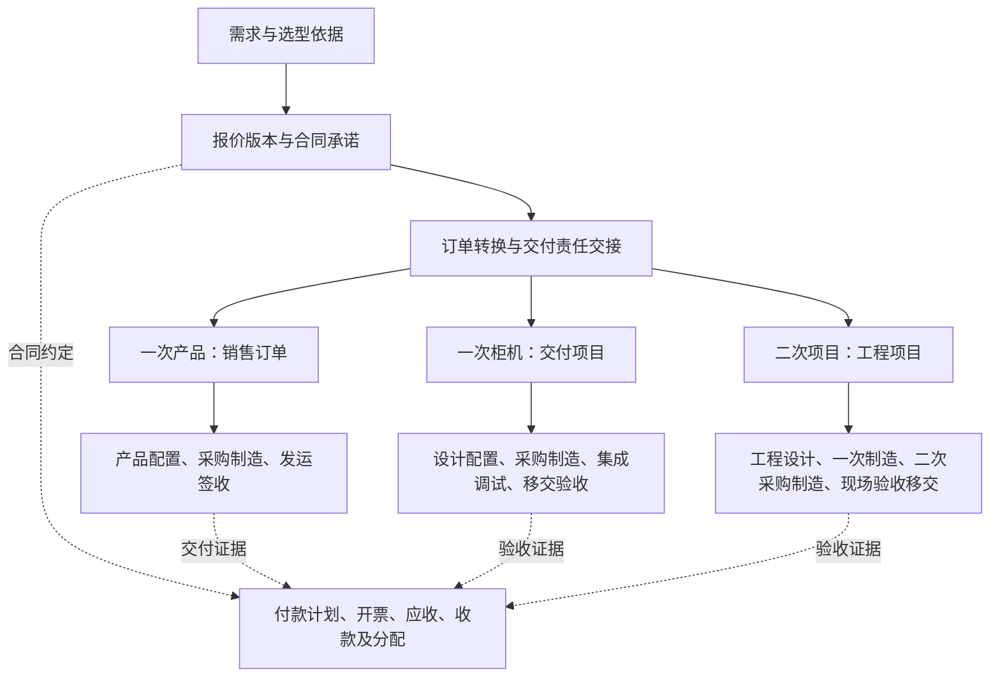

**Forge 的 RISEMAP 复刻、汇川 OTC 融入与 AI 实现方案**

编写于 2026-09-09。状态为设计建议，尚未实施或完成业务验收。

建议以 RISEMAP 的完整可观察能力建立业务底座，以汇川材料中的三类交付方法形成可配置的 OTC 业务规则，再让 AI 围绕真实记录完成采集、核对、解释和受控办理。ObjectStack 是优先验证的技术底座，业务规则与客户价值由 Forge 定义。

本稿将“融入汇川 OTC”理解为把已提供的管理方法产品化，服务汇川 OEM 客户。直接接入汇川内部系统是另一项集成工作，现有材料没有提供接口、数据责任或接入要求。本稿不把它视为已确定目标。

**证据与当前边界**

| 输入 | 本轮确认的事实 | 不能据此认定的结论 |
| --- | --- | --- |
| [完整复刻标准](risemap-replication-spec.md) | 目标覆盖全部模块、页面、交互、规则、权限、配置、报表和可用集成 | 不能退回八个页面或只做柜机；原三到四周不能代替完整估算 |
| [功能清单](risemap-feature-inventory.md)及实时采集记录 | 发现 181 个主导航入口；深度走查和标准数据贯联仍在推进 | 入口数不等于业务能力数；不能把空表单、状态选项或指引说明当作完整流程验证 |
| [定义原图 07/16](references/delivery-definitions-p07.jpg)、[流程原图 08/16](references/delivery-flows-p08.jpg) | 三类业务共享前端，在订单转换后分叉；一次产品、一次柜机、二次项目的管理主线不同 | 当前只有两页概览，不能宣称已经掌握汇川完整 OTC 制度、岗位责任、审批阈值与例外规则 |
| [9 月 7 日会议提炼](customer-meeting-20260907-findings.md)及[原文](references/customer-meeting-20260907.txt) | 客户侧陈述已有 ERP、BOM、采购物料成本和项目计划，关注工时分摊、变更影响及协作 | 尚未现场核验数据质量；一家企业的观察不能直接推广为全部 OEM 的共同规则 |
| [ObjectStack 既有源码拆解](objectstack-deep-dive.md)及本轮官方文档 | 对象、界面、状态、流程、审批、权限、AI 工具接入有对应机制 | 本项目尚未安装运行框架；文档、主分支与安装发布版不能混为同一个已验证版本 |

本轮目录核对仍只有业务文档、参考材料和采集脚本，没有可运行的 Forge 应用。既有汇总文档可能落后于持续追加的深度记录，详细行为应追溯功能编号与原始证据。

**产品如何组成**

建议保持同一套业务对象和业务动作，形成四部分可组合能力。

| 部分 | 具体职责 | 与其他部分的关系 |
| --- | --- | --- |
| Forge 基础业务 | 按证据复刻 RISEMAP 的销售、供应链、生产、项目、行政、财务、报表及系统能力 | 是完整复刻的验收范围；不因 OTC 只关注部分流程而删除其他模块 |
| OTC 业务规则 | 三类交付模板、订单交接、版本固定、阶段准入、变更处理、验收及回款条件 | 扩展基础对象与动作；已具备的能力直接复用 |
| AI 业务任务 | 材料整理、工作记录归集、变更分析、验收准备、经营问答及待办建议 | 使用同一业务数据；正式办理调用明确的业务动作 |
| 客户配置与连接 | 岗位、审批阈值、模板、编码、成本口径、ERP 等数据映射 | 将客户差异限制在可说明、可验证的配置和适配器内 |

业务包是建议的代码与元数据组织方式，不代表 ObjectStack 已提供开箱即用的“汇川 OTC 插件”。首版可在一个应用、一个部署单元内实现，不需要先拆成多套服务。OTC 适配启用前后分别跑对应验收，避免把适配差异计入 RISEMAP 一致性结果。

**OTC 应怎样落入流程**

共同前端由需求、选型、报价版本、内部审批、客户确认和合同承诺组成。其中报价细节是 Forge 的产品设计输入，两页汇川图片未展开完整报价制度。

资金流程按合同可以从预付款开始，与交付并行。签收、验收、开票、收款分别有状态和依据，不能用一个“已完成”同时代替。原材料包含回款与服务，完整复刻也包含财务能力，不能沿用历史缩版建议将其从当前目标中排除。

| 路径 | 主记录和差异 | 必须保留的判断 |
| --- | --- | --- |
| 一次产品 | 销售订单，关联配置版本、采购制造与发运签收；产品子类型有正标、ETO-、ETO 等 | 定制产品仍可能属于一次产品，不应因 ETO 自动转成二次工程，也不强制立项 |
| 一次柜机 | 交付项目，关联销售依据、设计配置、采购制造、集成调试和验收 | 一次制造可以有立项、工程设计和调试；发货后现场调试也不自动改变交付类别 |
| 二次项目 | 工程项目，增加二次采购、制造和现场工作，验收覆盖合同约定的系统或现场成果 | 一次设备制造、发货或签收只能完成对应子任务，不能结束整个工程项目 |

分别记录制造模式、交付物类别和业务子类型，并校验有效组合。模板控制适用环节、责任岗位和证据要求，不能把三个维度压成“标准／非标”一个字段。柜机的“3331 等”是图片举例，付款比例与节点必须读取具体合同。

一个合同可能包含混合交付或分批交付，现有材料尚未证实具体关系。建议在模型中预留订单行到交付单元的关联和数量分配，先用单路径实例验证，不提前固定合同、订单、项目一对一。

**把管理方法变成可以执行的交接规则**

每个关键环节至少需要输入版本、责任岗位、准入条件、输出证据、异常去向五项。以下是 Forge 建议的交接规则，不是已经核实的汇川正式关口编号或审批制度。

| 交接 | 通过时固化什么 | 不满足时怎样办理 |
| --- | --- | --- |
| 报价与承诺确认 | 适用报价版本、范围、交期、选型、付款及验收条件；内部审批与客户确认分别留证 | 返回缺失项或新建修订版；AI 提取结果保持草稿 |
| 订单转换 | 来源单据及行、交付路径、交付责任人、计划和预算依据、具体生成结果 | 保留可续办的转换记录；重复提交得到同一结果 |
| 配置或设计发布 | 已确认配置、BOM、图纸版本及其适用设备、订单或项目范围 | 未发布的设计不能被误当作正式制造依据；例外须记录适用范围与授权 |
| 采购制造与发运交接 | 物料或制造结果、检验结论、发运范围及数量；按业务模板确定要求 | 缺料、质量问题、分批交付分别进入对应处理分支 |
| 调试、验收与移交 | 合同验收项、调试记录、问题整改、客户确认及移交清单 | 失败项保留并复验；允许的带条件验收必须有合同及确认依据 |
| 收款与服务衔接 | 合同付款节点、开票与应收关系、实际收款分配、保修或服务移交依据 | 欠款与逾期继续显示；产品交付、工程完工与财务结清分别判断 |

计划至少同时保存原始承诺、最新批准计划、当前预测、实际结果。改期后仍显示对原始承诺的偏差。对新的批准日期也可以计算执行偏差，二者回答不同问题。

变更覆盖范围、设计、BOM、采购、制造、现场工作、成本、交期和验收条件。结构化关联确定已知影响，缺失关联列为待核对，不能用模型推断自动建立事实关系。

**RISEMAP 的能力如何复用**

下表是后续对照设计。表中的“补齐”都须在走查验证后确认，不能提前宣称 RISEMAP 没有这些能力。

| OTC 工作 | 已发现的 RISEMAP 对应入口 | 现有证据 | 需要重点核实或适配 |
| --- | --- | --- | --- |
| 需求、客户与报价 | RM-057 至 RM-064，尤其 RM-059 销售报价 | 报价表单有物料、服务费、条款和审核入口；DR-0279 至 DR-0311 | 成交版本与客户确认怎样冻结，后续订单是否引用同一版明细 |
| 合同到订单 | RM-046 框架销售合同、RM-047 销售订单 | DR-0178 至 DR-0183 记录项目关联、合同来源、授信及付款条件；有效单据转换待证 | 三种交付路径、分批与混合关系、责任交接、失败重试 |
| 配置、设计与变更 | RM-012 BOM，RM-073 至 RM-080 图纸 | DR-0425 至 DR-0435 已见变更表单包含采购、BOM、库存、在制及已交付设备影响 | 影响字段是人工说明还是实际关联，变更生效如何作用于具体业务版本 |
| 采购制造和发运 | RM-018 至 RM-045，RM-065 至 RM-093，RM-049 | 已有采购、库存、组装、委外和销售发货入口，贯联验证持续进行 | 三条交付路径如何使用这些能力，数量、批次、退换和冲销是否一致 |
| 项目执行 | RM-094 项目中心、RM-096 任务管理、RM-098 项目配置中心 | 首屏有计划模板、交付包模板；本轮读取时尚无这些功能编号的深度记录 | 模板是否版本化，是否区分原承诺和当前计划，验收材料及整改能否关联 |
| 工时与成本 | RM-097 工时、RM-095 项目分析、RM-140 成本中心、RM-141 费用中心 | 工时及成本入口已存在，不能按“缺工时模块”重新设计 | 能否减少重复填报，费率生效时间、审核、ERP 成本与工时归集是否一致 |
| 回款闭环 | RM-056、RM-133、RM-134、RM-139、RM-144 至 RM-148 | 有开票申请、应收、收款、收入确认和发票入口 | 合同节点、实际开票、收款分配和验收分别如何关联 |
| AI 与协作 | RM-002 AI 广场、RM-004 待办、RM-105 会议纪要、RM-106 工作汇报 | 已发现入口；AI 真实执行与权限未验证 | 工具调用、依据引用、输出确认与后续业务变化是否形成可复现链路 |

复刻单元应是一项可观察业务能力，包含页面、字段、动作、状态、关联、权限与结果。每个 RM 编号可以映射多个对象、多个动作和多个验收案例，不能按 181 个菜单生成 181 张独立数据表。

建议对照表增加 OTC 规则编号、现有能力判断、扩展对象／动作、AI 任务、同输入验收案例五项。结果分为已有且满足、已有需适配、待核实、确认缺失四类，再进入实施。

**AI 的产品价值与实施顺序**

会议已经提出一个直接的价值检验：如果员工仍须重复上传和统计，管理者只多看到一张看板，客户难以理解为什么购买。AI 应减少采集与汇总劳动，及时发现有依据的异常，并把问题送进有人负责的处理流程。

以下为本轮建议的目标能力，不沿用历史文档“只做两项 AI”作为整个产品上限，也不表示本轮已经批准或实现全部功能。

| 场景 | 具体输入与输出 | 正式记录怎样产生 | 验证收益 |
| --- | --- | --- | --- |
| 需求与报价准备 | 从客户材料提取范围、约束、选型和待澄清项；起草报价说明 | 每项附来源位置和版本，人员确认后进入需求或报价；金额由确定规则计算 | 比较完整准备时间及关键遗漏，不只比较生成速度 |
| 一次记录、多处复用 | 员工提交文字或语音工作记录，建议匹配项目、任务、工时和问题，再形成日报周报 | 员工确认项目与时长，按客户制度审核；不把考勤直接当项目工时 | 统计员工、经理和助理的填报、复核与汇总总时间 |
| 变更影响与问题推进 | 对比设计、BOM、计划及会议材料，列出已知受影响采购、任务、交期和验收项，起草处理单 | 规则计算已知数量金额与日期差异；责任人审核建议，正式变更审批后生效 | 关键影响召回率、误报、确认耗时，以及问题从发现到关闭的时间 |
| 验收准备 | 按合同版本、配置版本、调试记录和整改情况生成验收清单及材料目录 | 缺失证据明确列出；实际检查和客户确认决定验收结论 | 材料准备时间、遗漏项、返工次数 |
| 项目经营问答 | 回答交期、投入、未解决问题和付款阻塞，关联当前结构化记录与原始证据 | 查询和确定计算先得到事实，模型解释并提出待办；信息缺失不填零 | 事实可追溯性、回答时间、是否帮助业务人员作出具体处理决定 |

先在有可复核材料的需求整理、工作记录归集上建立输入闭环，再用真实历史变更验证影响分析与项目问答。验收准备随验收对象和版本规则接通。低风险的分类、摘要、草稿归档可以逐步自动化；正式承诺、预算批准、价格生效和客户验收继续由有权人员办理。

不必一开始为销售、采购、工程分别搭建相互自主指挥的 Agent。先让一个任务服务调用一组明确的业务工具，记录输入、结果与办理状态；复杂协作是否需要多个 Agent，再根据已测收益决定。

AI 任务统一保存来源记录与版本、调用者和客户范围、模型与提示版本、建议结果、引用、人工修订与采纳情况、耗时、成本及失败原因。来源版本变化后，旧建议标记需重新核对。模型不可用时，人员仍可完成主要业务动作。

项目事实从结构化查询取得，文档检索负责补充条款、会议及图纸说明。实时成本与库存不能只依赖向量检索。上传材料与群消息视为待分析内容，不授予它们改变系统流程或权限的能力。

**一个可检查的变更场景**

可以扩展现有 [OEM 标准测试草案](standard-test-data/risemap-oem-v0.1-research-draft.json)演示小非标柜机的贯联关系，另建版本记录新增变更，不覆盖正在运行的数据集。该草案是合成测试数据，不能充当真实客户的价值验证。

假设工程师提交“客户提出变更某接口，需修改图纸，现场调试预计增加时间”。这些内容只是待确认输入，不提前当作已生效要求。

1. AI 匹配候选项目、设备和图纸，列出原文依据、拟修改内容及无法判断的信息。
2. 系统查询该版本的 BOM、未结采购、在制或已发运设备、后续任务和合同验收项。
3. 对存在明确关联的数据计算差异；缺少供应商交期或现场工作量时显示未知。模型解释影响并起草变更申请及跨部门待办。
4. 责任人核对范围、报价与交期影响，按客户配置送审；批准后形成新版本和处理任务。
5. 采购、设计、现场分别反馈执行依据；相关验收项同步到新的适用版本。未完成的问题继续阻塞相应阶段。
6. 管理者查询时得到当前事实、相对原承诺的偏差、未决事项及下一责任人。系统保留原始承诺，不能通过改日期把原偏差消掉。

需要对照“人工完成”“已有规则与模板”“规则加 AI”三种方式。让业务人员预先标注真实影响，衡量总处理时间、关键漏项、误报和复核成本。若 AI 没有增加收益，就保留确定规则与普通表单，不因接口已接通而强行保留 AI。

**ObjectStack 应承担哪一层**

截至本轮核对，官方文档描述了数据模型、元数据界面、Flow、Workflow、审批和权限机制。以下是基于这些机制的实现建议，不是 Forge 运行通过的报告。[数据建模](https://objectstack.ai/docs/data-modeling)、[界面](https://objectstack.ai/docs/ui)、[自动化](https://objectstack.ai/docs/automation)

| 技术部分 | Forge 的内容 | 实现边界 |
| --- | --- | --- |
| Spec 与 ObjectQL | 客户、单据、版本、关系、查询和基础校验 | 普通业务记录使用元数据；复杂计算和跨记录业务约束由 Forge 明确实现 |
| ObjectUI 与页面 | 列表、普通表单、看板、任务页 | 对照 RISEMAP 验证交互；报价明细、BOM、复杂弹窗及材料核对按需要定制 |
| Workflow | 报价、变更、验收等记录的状态、允许转换与条件 | 正式状态应在服务端强制校验，直接接口和明细修改也必须受约束 |
| Flow 与审批 | 交接步骤、审批等待、通知、超时和恢复 | 不把跨系统长事务塞进一次保存；业务结果与失败记录可追溯 |
| Forge 业务动作 | 固定报价版本、订单转换、发布配置、应用变更、登记验收、分配收款 | 保证前置条件、权限、重复请求和一致性；金额及数量使用确定规则 |
| 权限机制 | 岗位能力、项目协作范围、成本字段、客户隔离 | 岗位与权限集按当前模型声明，并实际验证页面、接口、附件、导出与 AI |
| AI 接入 | 模型服务、材料解析、引用、草稿复核和业务工具 | 自接业务 AI 任务运行服务；MCP 是接入方式之一，应用内部调用可使用同一受控服务接口 |
| 存储与连接 | 持久数据库、附件、ERP 适配、导入及同步记录 | 实施前固定驱动、版本、数据责任和恢复方式 |

ObjectUI 支持元数据页面和 React 页面扩展，但生成通用管理界面不能证明已经复刻 RISEMAP 的布局与操作。若复杂页面需要独立 React 前端，也应复用同一套业务接口，不复制服务端规则。[React 页面机制](https://objectstack.ai/docs/ui/react-pages)

**核心对象和关系**

名称为建议逻辑模型，不是已存在的 SDK 类型。基础复刻中已建立的同义对象优先复用，仅补缺少的版本、关系与规则。

| 对象组 | 建议对象 | 要解决的问题 |
| --- | --- | --- |
| 共用商业记录 | Customer、Opportunity、Requirement、Quote、QuoteRevision、QuoteLine、Contract | 客户承诺从哪里来，正式使用的是哪个版本，行金额怎样确定 |
| 交付承接 | SalesOrder、SalesOrderLine、OrderConversion、DeliveryAssignment、Project | 一个转换动作产生什么，订单行数量对应哪些交付单元；产品路径允许不关联项目 |
| 方法与版本 | DeliveryTemplate、TemplateRevision、StageInstance、CommitmentBaseline、PlanRevision | 什么类型用什么流程，原承诺与计划修订怎样追溯，在途业务使用哪个模板版本 |
| 工程执行 | ConfigurationRevision、BOMRevision、DrawingRevision、Task、ChangeRequest、Issue | 设计和任务使用哪个版本，变更影响哪些业务和设备 |
| 交付证据 | Shipment、Receipt、CommissioningRecord、AcceptanceItem、AcceptanceRecord、Handover | 发运、签收、调试、验收、移交各自凭什么完成 |
| 经营与资金 | BudgetRevision、WorkLog、Timesheet、CostEntry、PaymentMilestone、Invoice、Receivable、ReceiptAllocation | 预算、工时与成本的口径，合同付款节点与实际资金怎样对应 |
| 支撑记录 | EvidenceLink、AITask、AIProposal、IntegrationLink、IntegrationEvent、ActionReceipt | 来源与人工采纳、跨系统映射、重复请求结果和失败恢复 |

DeliveryAssignment 只是建议的关联记录，用于连接订单行、交付范围、数量和可选项目，不建立第二套重复的项目主数据。混合与拆分关系须通过实际单据确认后冻结。

模板发布产生新版本，已有业务继续引用原版本。迁移在途流程需要显式记录迁移前后规则及未完成任务的处理。金额使用明确的币种、税口径、精度与舍入方式；工时成本使用客户确认的费率及其有效日期，不由 AI 生成金额。

项目已发生成本、尚未结清的采购承诺和剩余工作估算应分别表达，汇总时消除同一笔业务在采购、入库和成本记录中的重复计入。缺失人力费用时显示成本不完整，不能宣称已得出真实项目毛利。

**业务动作的运行方式**

建议的动作包括 `freeze_quote_revision`、`convert_order`、`release_configuration`、`submit_change`、`apply_approved_change`、`record_acceptance`。这些只是拟定名称，后续根据固定版本的 Action 定义实现。

以 `convert_order` 为例：读取已确认来源及版本，核对调用者可访问的客户、订单和行，校验路径和必需输入，再依据唯一请求标识创建或读取转换结果。记录输入摘要、源版本和实际生成对象。同一请求标识携带不同输入必须拒绝。

同库、要求同时生效的记录，应通过已验证的事务能力保证一致。外部 ERP 写入与后续通知使用持久任务、唯一业务标识和回执，失败时明确显示待处理或失败并允许重试。不能依赖异步 Hook 中“失败只写日志”来表示业务交接完成。框架如不能通过受支持接口实现关键一致性，应记录为选型阻塞。

**AI 接入中需要校正的一项认识**

官方区分开源框架的自接模型、MCP 与知识接入能力，以及 ObjectOS 提供的产品内聊天运行服务。安装框架不能直接得到 Forge 的项目业务助手。[AI 官方说明](https://objectstack.ai/docs/ai)

本轮官方 Actions 文档进一步明确，脚本／内联动作体可按应用级可信代码执行，内部数据调用不自动继承调用者的行、字段权限；Flow 动作依其 `runAs` 运行。MCP 的动作暴露与调用许可不等于每次内部读写都受用户权限保护。因此，Forge 的业务动作必须显式检查客户、目标记录、关联记录及允许写入范围，并验证所选发布版的实际行为。[Actions as Tools](https://objectstack.ai/docs/ai/actions-as-tools)

开源 MCP 的 `requiresConfirmation` 主要向客户端表达确认意图。报价批准、正式变更和验收等业务审批，仍应保存可验证的审批决定，并由执行动作校验；不能用模型回答“用户同意”或一个确认提示代替业务审批。

当前官方权限模型使用岗位、权限集、业务单元、记录范围与字段规则。成本字段需要显式设置，页面隐藏不算数据限制。框架商业能力边界及组织层级授权按固定版本逐项验证。[权限文档](https://objectstack.ai/docs/permissions)

**已有 ERP 的客户怎样使用**

完整复刻决定 Forge 产品具有什么能力，客户现场的职责配置决定由哪套系统保存和生效具体记录。拥有完整模块不意味着每位客户都要替换正在工作的 ERP。

| 数据或动作 | 已有 ERP 客户的建议归属 | Forge 如何使用 |
| --- | --- | --- |
| 物料、采购、库存、实际财务记录 | 优先沿用客户现有权威系统，具体按单据和字段确认 | 导入或同步带来源的记录，保留外部 ID、源版本、更新时间和同步状态 |
| 交付承诺、计划版本、问题、现场调试与验收 | 按现有工具覆盖情况决定，Forge 可承接缺口 | 关联订单和项目，使跨部门办理可追溯 |
| 工时与项目成本 | 工时可在 Forge 采集；物料与财务成本优先读取已确认来源 | 统一项目对应和成本口径，区分实际、承诺和估算 |
| 正式外部系统写入 | 由经过确认的接口和审批规则控制 | 保存请求、结果及重试依据，避免两套系统同时无规则修改同一字段 |

没有接口时可以先使用有校验的文件导入，但须展示数据时间和来源，不宣称实时。每个系统、客户、单据、行建立稳定映射；用项目名相同或手填同一编号不能证明外键关联已经成立。

暂未使用 ERP 的客户可以更多使用 Forge 原生业务能力，仍沿用同一对象与 OTC 规则。两种使用方式是否形成正式交付套餐，要由客户验证决定。

**执行顺序与通过条件**

当前完整复刻任务继续推进，本稿先提供适配设计。可以同步补齐业务材料和进行 ObjectStack 有限技术试验；OTC 功能适配按现有约定在复刻后单独验收。

| 阶段 | 要形成的具体结果 | 通过条件 |
| --- | --- | --- |
| 1. 证据与映射 | RM 功能、三类流程、对象、动作、权限、异常和同输入案例逐项关联 | 未知项明确；页面说明与已执行行为分开；完整目标保留 |
| 2. ObjectStack 技术初筛 | 固定版本运行小型验证应用，覆盖来源版本、转换、审批、持久化和复杂表单 | 产品不被强迫立项；版本不可覆盖；审批重启可续办；重复转换唯一；关键规则无需改内核 |
| 3. 完整业务复刻 | 按业务域分批实现，跨域以同一测试输入验证 | 全清单和跨域流程均有结果；未开放角色或集成仍列缺口；满足正式运行条件 |
| 4. OTC 适配 | 三类模板、交接规则、变更、版本、验收与资金条件 | 用真实脱敏单据逐条回放，业务负责人核对规则和例外；模板升级不改写旧业务 |
| 5. AI 价值验证 | 在真实材料上比较人工、规则、规则加 AI 的完整工作 | 事先确定关键漏项、复核负担与时间指标；证据可追溯；没有收益的任务停止扩大 |
| 6. 客户运行验收 | 真实身份、持久记录、开通、恢复、升级及异常续办 | 达到[首版交付要求](first-release.md)，不能用技术样例代替客户验收 |

两天技术初筛可以作为投入上限建议，不能解释成两天实现 OTC。应在开始时选定准确的框架、插件、驱动、Console 和 Node 版本并保存锁文件；官网发布政策说明次版本也可能包含破坏性变更，实施期间不浮动跟随主分支。[版本政策](https://objectstack.ai/docs/releases)

初筛至少验证五类问题：审批等待期间重启；重复和并发订单转换；已确认主表与明细被直接修改；不同客户和岗位经页面、接口与 AI 动作访问；正式编译运行后规则与数据持久性。通过初筛后，完整复刻还要验证库存与金额守恒、冲销、分批及外部失败，不能用小型柜机样例推导全系统已可靠。

**下一批需要补齐的业务证据**

当前能够形成架构方向。要把它变成实际可配置流程，下一批优先取得三类业务各一份脱敏完整履历，涵盖报价／合同、订单、配置／BOM／图纸、计划、变更、发运、调试／验收和资金关联。用现成材料回放，减少要求客户重新整理的工作。

随后集中确认每个环节的实际责任人、审批阈值、完成证据、例外处理与成本口径；核实 ERP 导出或接口样本。缺少这些信息的规则留为待确认项，不由模板或 AI 补写为汇川制度。

本轮产物仅为本方案。未修改 RISEMAP 采集数据、既有业务定义、当前实施范围或应用代码，未安装框架，未声称实现与客户价值验证完成。
